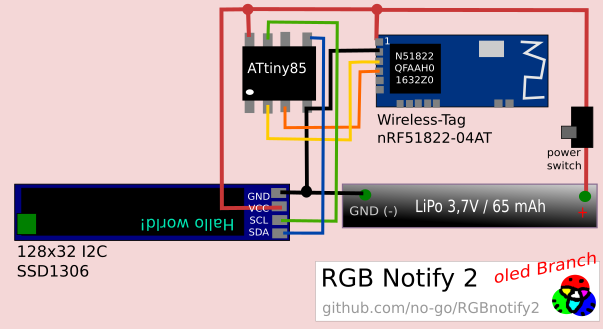

# RGB Notify 2

This App is part of a small ATtin85 project. It sends a specific LED color code to a ATtiny85 and nRF51822 (UART) device:

  - 0..9 - black to white
  - A..J - red value
  - L..S - green value
  - T..Z - blue value

Some "Disco modes" are added, too!

## App

You can optionaly get a signed APK from here: [APK](https://raw.githubusercontent.com/no-go/RGBnotify2/master/app/app-release.apk)

## The Firmware

[firmware for Arduino IDE](https://raw.githubusercontent.com/no-go/RGBnotify2/master/firmware/firmware.ino)

## Circuit

ATTENTION! the Lipo has sometimes more than 3.7 V. The nRF51822 Chip NEEDS 3.3 - 3.6 V. Thus, this circuit may brick your bluetooth module!!!

## License

I publish everything under the free BSD-3 License.

## Privacy Policy

### Personal information.

Personal information is data that can be used to uniquely identify or contact a single person. I DO NOT collect, transmit, store or use any personal information while you use this app.

### Non-Personal information.

I DO NOT collect non-personal information like user's behavior:

 -  to solve App problems
 -  to show personalized ads

The google play store collect non-personal information such as the data of install (country and equipment).

### Bluetooth and Position access

Google Play requires me to disclose this App will take access to your position. Your position is not send to any one. The Bluetooth Low Energy needs access to position data - I do not know, why. Every information you send via bluetooth may be
sniffed by hackers.

### Privacy Questions.

If you have any questions or concerns about my Privacy Policy or data processing, please contact me.
